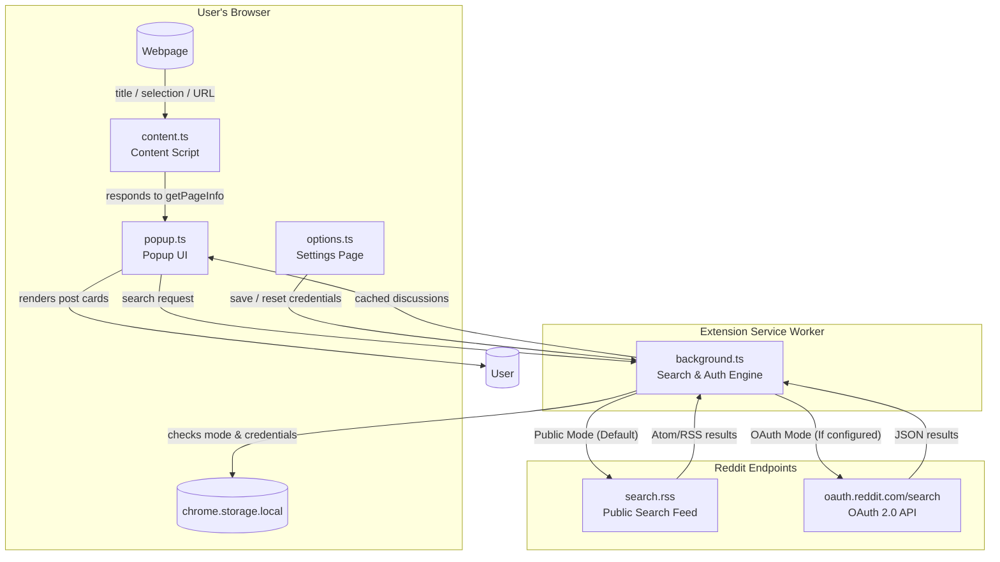

# Reddit Context Helper

A Chrome extension that finds relevant Reddit discussions for whatever page you're currently browsing. Open it, and it automatically searches Reddit based on your highlighted text, the webpage title, or URL keywords.

Works **out-of-the-box with zero configuration** (no API key or Reddit account needed) via Reddit's native public search feeds, with optional **OAuth API mode** for approved developers.

---

## Features

- **Dual-Mode Search Engine:**
  - **Public Search Mode (Default):** Ready to use instantly upon installing with zero setup, zero keys, and zero developer approvals.
  - **OAuth API Mode (Optional):** Supports Reddit OAuth2 (`client_credentials`, `installed_client`, and `password` grant types) for real-time upvotes, comment counts, and higher rate limits.
- **Context-Aware Query Detection:**
  1. **Selected text** — Highlight any text on a page to search for that exact topic.
  2. **Page title** — Intelligently strips stopwords and punctuation to find discussions about the page topic.
  3. **URL keywords** — Fallback that extracts meaningful keywords from the URL path.
- **Interactive UI:**
  - **50% / 50% Top Action Bar:** One-click mode switching (`🔄 Switch Mode` / <kbd>S</kbd>) and dedicated Settings & Guide (`⚙️ Settings & Guide`).
  - **Filter Bar:** Sort by Relevance, Hot, Top (with All time / Year / Month / Week / Day / Hour timeframes), New, and Comments.
  - **Dedicated Settings & Guide Page:** Full-tab options page with live connection testing, policy explanations, and reset controls.
- **Smart Performance & Caching:**
  - In-memory result caching (5-minute TTL) to avoid duplicate network requests.
  - Request throttling and background token lifecycle management.

---

## Getting Started

Since this is an unpacked extension, you can load it in Chrome in under a minute:

### 1. Clone the repository
```bash
git clone https://github.com/dexisback/redditHelp.git
cd redditHelp
```

### 2. Install dependencies & compile TypeScript
```bash
npm install
npm run build
```

This compiles the TypeScript files in `src/` into runnable JavaScript in `dist/`.

### 3. Load unpacked in Chrome
1. Navigate to `chrome://extensions` in your Chromium-based browser (Chrome, Brave, Edge, Arc, etc.).
2. Toggle on **Developer mode** (top right corner).
3. Click **Load unpacked** (top left corner).
4. Select the `redditHelp` directory (the root folder containing `manifest.json`).
5. Pin the extension to your toolbar.

---

## Architecture



---

## Folder Structure

```
redditHelp/
├── src/                  # TypeScript source files
│   ├── background.ts     # Service worker: dual-mode search engine, OAuth & token caching
│   ├── content.ts        # Content script: live selection & page metadata gatherer
│   ├── options.ts        # Settings & guide page logic (auth testing & mode management)
│   └── popup.ts          # Main popup UI logic, mode switcher, and filtering
│
├── dist/                 # Compiled JavaScript output (generated by `npm run build`)
│   ├── background.js
│   ├── content.js
│   ├── options.js
│   └── popup.js
│
├── manifest.json         # Manifest V3 configuration & permissions
├── popup.html            # Main popup markup with 50/50 action buttons
├── popup.css             # Popup UI styles (supports Dark Mode)
├── options.html          # Dedicated full-page settings & step-by-step setup guide
├── options.css           # Options page styles
├── tsconfig.json         # TypeScript compiler configuration
└── package.json          # Project dependencies & build scripts
```

---

## Search Modes & Reddit Policy (2026)

### Public Search Mode (Default)
For standard users, the extension uses Reddit's native search syndication feeds (`https://www.reddit.com/search.rss`). It requires no API keys, accounts, or approvals.

### OAuth API Mode (Optional for Approved Developers)
Under Reddit's **Responsible Builder Policy**, self-service app creation on `reddit.com/prefs/apps` is restricted for standard accounts. 

If you already have an **approved developer account** or pre-existing Reddit application:
1. Click **⚙️ Settings & Guide** in the extension to open the options tab.
2. Enter your **Client ID** and **Client Secret**.
3. Click **Save & Connect OAuth**. *(Accounts with 2FA enabled do not require a password).*
4. You can click **Reset to Public Search Feed** at any time to return to zero-config mode.

---

## Keyboard Shortcuts

- <kbd>S</kbd> — Cycle search modes (Selected Text → Page Title → URL Keywords)
- <kbd>R</kbd> — Refresh current search
- <kbd>Esc</kbd> — Close popup

---

## License

MIT License. Feel free to use and contribute!
