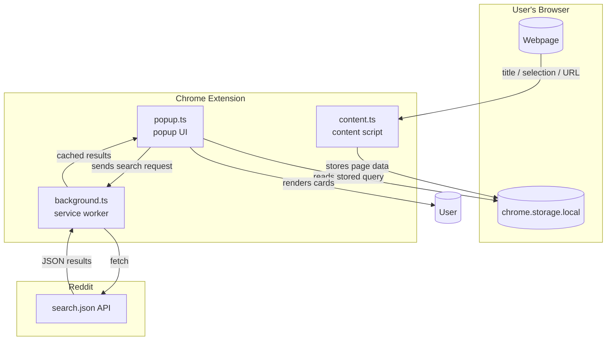

# Reddit Context Helper

A Chrome extension that finds relevant Reddit discussions for whatever page you're currently on. Open it, and it automatically searches Reddit based on the page title or any text you've highlighted. No API key, no account needed — it uses Reddit's public search endpoint.

---

## Getting started

Since this isn't on the Chrome Web Store, you'll need to load it manually. It takes about a minute:

**1. Clone the repo**
```bash
git clone https://github.com/dexisback/redditHelp.git
cd redditHelp
```

**2. Install dependencies and build**

The source code is TypeScript, so you need to compile it once before loading the extension.

```bash
npm install
npm run build
```

This generates the `dist/` folder with the compiled JavaScript that Chrome actually runs.

**3. Load it in Chrome**

- Go to `chrome://extensions` in your browser
- Toggle on **Developer mode** (top right corner)
- Click **Load unpacked** (top left)
- Select the `redditHelp` folder (the root of the repo, not `src/` or `dist/`)

You should see the extension appear in your toolbar. If the icon isn't visible, click the puzzle piece icon in Chrome and pin it.

> Works on any Chromium-based browser — Chrome, Brave, Edge, etc etc.

---

## How it works

When you click the extension icon, it looks for a search query in this order:

1. **Selected text** — Given the most priority. If you've highlighted something on the page, it searches for it
2. **Page title** — falls back to the page title with stopwords stripped out if no selected text
3. **URL path** — last resort, pulls keywords from the URL/metadata if the title is useless/not found

Results show :
- the post title, 
- subreddit, 
- upvote count, 
- age,  
- comment count. 

Clicking a result opens the Reddit thread.

---

## Architecture



---

## Folder structure

```
redditHelp/
├── src/                  # TypeScript source — this is what you edit
│   ├── background.ts     # service worker, handles Reddit API calls + caching
│   ├── content.ts        # runs on every page, captures title and selected text
│   └── popup.ts          # drives the popup UI
│
├── dist/                 # compiled JS output from `npm run build` (gitignored)
│
├── manifest.json         # Chrome reads this first — points scripts to dist/
├── popup.html            # popup markup, loads dist/popup.js
├── popup.css             # popup styles
└── tsconfig.json         # TypeScript config, compiles src/ → dist/
```

`manifest.json` lives at the root because Chrome requires it there. It references `dist/background.js` as the service worker and `dist/content.js` as the content script. `popup.html` (also at root) loads `dist/popup.js`. You never touch `dist/` directly — just run `npm run build` and it gets regenerated.

---


## Notes

- Results are cached for 5 minutes so repeated searches on the same page don't hammer the API
- There's a 1 second rate limit between searches
- NSFW results are filtered out by default
- will be tweaking the styles a bit soon, and adding query filtering options soon, along with enabling 15-20 ish queries
